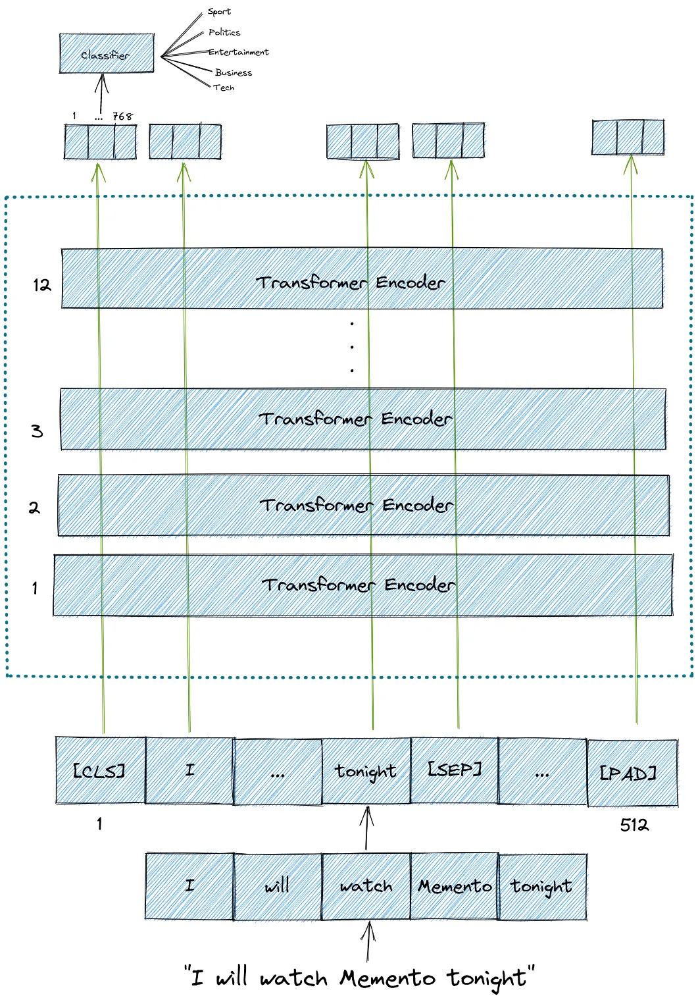

### BERT Input and Output

BERT model expects a sequence of tokens (words) as an input. 
In each sequence of tokens, there are two special tokens that 
BERT would expect as an input:

1. [CLS]: This is the first token of every sequence, which stands for 
classification token.

2. [SEP]: This is the token that makes BERT know which token belongs to 
which sequence. This special token is mainly important for a next sentence 
prediction task or question-answering task. If we only have one sequence, 
then this token will be appended to the end of the sequence.

 We only need one line of code to transform our input sentence into a sequence 
 of tokens that BERT expects. We will use ```BertTokenizer``` to do this and you 
 can see how we do this later on.
 
It is also important to note that the maximum size of tokens that can be fed into 
BERT model is 512. If the tokens in a sequence are less than 512, we can use 
padding to fill the unused token slots with [PAD] token. If the tokens in a 
sequence are longer than 512, then we need to do a truncation.

BERT model then will output an embedding vector of size 768 in each of the tokens. 
We can use these vectors as an input for different kinds of NLP applications, 
whether it is text classification, next sentence prediction, 
Named-Entity-Recognition (NER), or question-answering.

Below is the illustration of the input and output of the BERT model.



### Data Preprocessing

In this example, we’re going to use the BBC News Classification dataset. 
If you want to follow along, you can [download the dataset on Kaggle](https://www.kaggle.com/datasets/sainijagjit/bbc-dataset).

This dataset is already in CSV format and it has 2126 different texts, 
each labeled under one of 5 categories: <em>entertainment, sport, tech, 
business, or politics</em>.

We need to transform our text into the format that BERT expects by adding [CLS] and 
[SEP] tokens. We can do this easily with ```BertTokenizer``` class from Hugging Face.

Here is the explanation of ```BertTokenizer``` parameters:

* ```padding``` : to pad each sequence to the maximum length that you specify.
* ```max_length``` : the maximum length of each sequence. 512 is the maximum length of 
a sequence allowed for BERT.
* ```truncation``` : if True, then the tokens in each sequence that exceed the maximum 
length will be truncated.
* ```return_tensors``` : the type of tensors that will be returned. Since we’re using 
Pytorch, then we use pt. If you use Tensorflow, then you need to use tf.

The output of ```BertTokenizer``` contains the following data:
* ```input_ids``` is the id representation of each token. 
* ```token_type_ids``` is a binary mask that identifies in which sequence a token belongs. 
If we only have a single sequence, then all of the token type ids will be 0. 
* ```attention_mask``` is a binary mask that identifies whether a token is a real word or 
just padding. If the token contains [CLS], [SEP], or any real word, then the mask would 
be 1. Meanwhile, if the token is just padding or [PAD], then the mask would be 0.

### Dataset Class

Now let's build a ```Dataset``` class which will serve as a class to generate our news data.

```
import torch
import numpy as np
from transformers import BertTokenizer

tokenizer = BertTokenizer.from_pretrained('bert-base-cased')
labels = {'business':0,
          'entertainment':1,
          'sport':2,
          'tech':3,
          'politics':4
          }

class Dataset(torch.utils.data.Dataset):

    def __init__(self, df):

        self.labels = [labels[label] for label in df['category']]
        self.texts = [tokenizer(text, 
                               padding='max_length', max_length = 512, truncation=True,
                                return_tensors="pt") for text in df['text']]

    def classes(self):
        return self.labels

    def __len__(self):
        return len(self.labels)

    def get_batch_labels(self, idx):
        # Fetch a batch of labels
        return np.array(self.labels[idx])

    def get_batch_texts(self, idx):
        # Fetch a batch of inputs
        return self.texts[idx]

    def __getitem__(self, idx):

        batch_texts = self.get_batch_texts(idx)
        batch_y = self.get_batch_labels(idx)

        return batch_texts, batch_y
```

After defining dataset class, let’s split our dataframe into training, validation, and test 
set with the proportion of 80:10:10.

```
np.random.seed(112)
df_train, df_val, df_test = np.split(df.sample(frac=1, random_state=42), 
                                     [int(.8*len(df)), int(.9*len(df))])

print(len(df_train),len(df_val), len(df_test))
>>>1780 222 223
```

### Model Building

So far, we have built a dataset class to generate our data. Now let’s build the actual model 
using a pre-trained BERT base model which has 12 layers of Transformer encoder.

```
from torch import nn
from transformers import BertModel

class BertClassifier(nn.Module):

    def __init__(self, dropout=0.5):

        super(BertClassifier, self).__init__()

        self.bert = BertModel.from_pretrained('bert-base-cased')
        self.dropout = nn.Dropout(dropout)
        self.linear = nn.Linear(768, 5)
        self.relu = nn.ReLU()

    def forward(self, input_id, mask):

        sequence_output, pooled_output = self.bert(input_ids= input_id, attention_mask=mask,return_dict=False)
        dropout_output = self.dropout(pooled_output)
        linear_output = self.linear(dropout_output)
        final_layer = self.relu(linear_output)

        return final_layer
```

As you can see from the code above, BERT model outputs two variables:

* The first variable named ```sequence_output```contains the embedding 
vectors of all of the tokens in a sequence.
* The second variable, which we named ```pooled_output```, contains the embedding 
vector of [CLS] token. For a text classification task, it is enough to use 
this embedding as an input for our classifier.

We then pass the pooled_output variable into a linear layer with ReLU activation function. 
At the end of the linear layer, we have a vector of size 5, each corresponds to a category 
of our labels (<em>sport, business, politics, entertainment, </em>and <em>tech</em>).

### Training and Evaluation

The  training and evaluation processes are conventional. I will not explain here. However, 
you can find the full demonstration of this example [here](text_classification_bert.py)
I hope this example helps you to get started with BERT.
